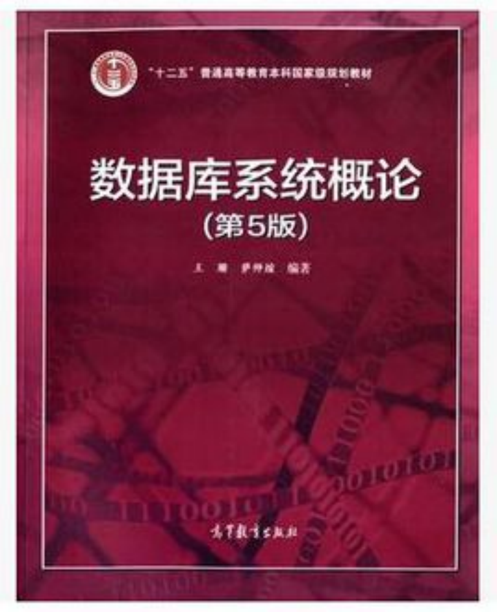

<!-- _class: cover_e -->
<!-- _paginate: "" -->
<!-- _footer:  -->
<!-- _header:  -->

# 第1章 数据库系统的基本原理

###### “万丈高楼平地起。”

井明
数据科学与计算机学院
jingming@sdu.edu.cn
2025年3月14日

## 课程的任务、目的和基本要求

<!-- _class: cols_ol_sq fglass -->

- 了解数据库系统的体系结构与特点、数据库管理系统的功能。
- 了解关系模型的基本概念。
- 掌握关系代数语言的使用。
- 掌握结构化查询语言（SQL）的用法。
- 掌握关系数据库规范化理论，能够利用分解算法将关系模式进行合理的分解。
- 掌握数据库设计方法。
- 了解数据库系统维护的相关概念和方法（数据库恢复、并发控制、安全性控制和完整性控制等）。

## 主要教学内容

<!-- _class: cols_ol_sq fglass -->

第一章	数据库系统的基本原理
第二章	关系数据库标准语言SQL
第三章	数据库编程
第四章	关系模型的基本理论
第五章	数据库的安全性
第六章	事务与并发控制 
第七章	故障恢复
第八章	使用实体-联系模型进行数据建模
第九章	关系模型规范化设计理论
第十章	数据库设计

## 教材、参考书

<!-- _class: cols_ol_sq fglass -->

教材：
- 《数据库原理与应用（MySQL 版）》第 2 版，李月军，清华大学出版社，2023 年

参考书：
- 《数据库系统概论》（第5版），王珊、萨师煊，高等教育出版社，2014。
- 《数据库系统工程师教程》（第 4 版），王亚平 、刘伟 ，清华大学出版社，2022。
- 《数据库系统工程师2014至2019年试题分析与解答》，全国计算机专业技术资格考试办公室，清华大学出版社，2020。

### 参考书

<!-- _class: cols-3 -->

## 本章目标

- 了解数据管理技术的产生和发展。
- 掌握数据库、数据库管理系统、数据库系统的概念。
- 掌握数据库系统的特点。
- 掌握数据模型的组成要素、常用数据模型、概念模型、关系模型。
- 掌握数据库系统结构、数据库系统的三级模式结构。
- 掌握数据库系统的组成。

## 本章内容

1. 数据库系统概述
2. 数据模型
3. 数据库体系结构
4. 高级数据库系统
5. 数据仓库技术与数据挖掘技术
6. 非关系型数据库（NoSQL）

### 1.1 数据库系统概述

#### 1.1.1 数据库系统的应用

数据库系统广泛应用于：

- **政府机构**
- **电信业**
- **航空业**
- **金融业**
- **银行业**

#### 1.1.2 数据库系统的概念

- **数据（Data）**：描述现实世界中各种具体事物或抽象概念的、可存储并具有明确意义的符号记录。
- **数据库（DataBase, DB）**：一个长期存储在计算机内、有组织的、可共享的大量数据的集合。
- **数据库管理系统（DataBase Management System, DBMS）**：数据库系统的核心部分，如 Oracle、MySQL、SQL Server。
- **数据库系统（DataBase System, DBS）**：DBS = DB + DBMS + DBA + 应用系统。
- **数据库应用系统（DBAS）**：如图书管理、铁路订票、证券交易等。

#### 1.1.3 数据管理技术的发展阶段

1. **人工管理阶段**：数据不保存、不具有独立性、不共享。
2. **文件管理系统阶段**：数据冗余高、不一致性大、独立性差。
3. **数据库系统阶段**：通过 DBMS 统一管理数据库。

数据库系统的特点：

- 数据结构化。
- 共享性高，冗余度低，易扩充。
- 数据独立性高。
  - 数据独立性是指数据与程序的独立; 
  - 包括逻辑独立性和物理独立性。
- 数据由 DBMS 统一管理和控制（完整性检查、并发控制、安全性、恢复等）。

#### 1.1.4 数据库系统的用户

1. **数据库管理员（DBA）**
   - 参与数据库设计。
   - 维护数据库安全性、完整性。
   - 进行日常维护和优化。

2. **数据库用户**
   - 最终用户。
   - 专业用户（如工程师、科学家）。
   - 系统分析员、数据库设计人员。
   - 应用程序员。

#### 测试

与文件系统阶段相比，关系数据库技术的特点不包括：

A. [ ] 数据结构化
B. [ ] 数据冗余小，实现了数据共享
C. [ ] 具有较高的数据和程序独立性
D. [ ] 支持面向对象的数据模型

#### 测试

与文件系统阶段相比，关系数据库技术的特点不包括：

A. [ ] 数据结构化
B. [ ] 数据冗余小，实现了数据共享
C. [ ] 具有较高的数据和程序独立性
D. [x] 支持面向对象的数据模型

### 1.2 数据模型

#### 1.2.1 数据抽象的过程

- **概念模型（E-R模型）**
  - 实体（Entity）：客观存在并可相互区别的事物称为实体。
  - 属性（Attribute）：实体所具有的某一特性称为属性。
  - 码（Key）：能唯一标识实体的最小属性集，又称为键或关键字。
  - 关系（Relation）：两个或多个实体间的关联。一对一（1:1 如学校和校长）、一对多（1:N 如学校和学生）、多对多（M:N 如学生和课程）。
- **逻辑模型**
  - 逻辑模型是设计人员对整个企业组织数据库的全面概述。
  - 逻辑模型是从数据库实现的观点出发，对数据建模。
  - 逻辑模型硬件独立，但软件依赖。
  - 逻辑模型是数据库设计人员与应用程序员之间进行交流的工具
  - 关系模型、层次模型、网状模型。

---

- **外部模型**
  - 外部模型是逻辑模型的一个逻辑子集。
  - 硬件独立，软件依赖。
  - 外部模型反映了用户使用数据库的观点。
  - 反映用户视图，增强安全性。
- **内部模型**
  - 物理存储结构。内部模型又称为物理模型，是数据库最底层的抽象，它描述数据在磁盘上存储方式、存取设备和存取方法。由系统自动实现。

#### 1.2.2 关系模型

1. **数据结构**
   - 关系（Relation）= 二维表。
   - 元组（Tuple）= 表中的一行。
   - 属性（Attribute）= 表中的一列。
   - 关系模式：`关系名（属性1, 属性2, ...）`

---

> 思考：
>
> 以上表有什么问题？

---
2. **关系操作**
   - 查询（SELECT）、插入（INSERT）、删除（DELETE）、更新（UPDATE）。

3. **完整性约束**
   - 实体完整性、参照完整性、用户定义完整性。

### 1.3 数据库体系结构

#### 1.3.1 数据库系统三级结构

<!-- _class: cols-2-46 -->

  

- **外模式**（用户视图）
- **模式**（概念模式）
- **内模式**（物理存储）

#### 1.3.2 数据库系统的二级映射

- **逻辑独立性**：应用程序与逻辑结构独立。
- **物理独立性**：应用程序与物理存储独立。

#### 1.3.4 数据库应用系统的开发架构

1. **C/S模式（Client/Server）**
   - 两层 C/S
   - 三层 C/S
2. **B/S模式（Browser/Server）**

### 1.4 高级数据库系统

- **分布式数据库系统**
- **面向对象数据库系统**
- **并行数据库系统**
- **多媒体数据库系统**

### 1.5 数据仓库技术与数据挖掘技术

1. **数据仓库（Data Warehouse, DW）**
   - 面向主题、集成、稳定、时间相关的数据集合。
2. **联机分析处理（OLAP）**
   - 处理多维数据。
3. **数据挖掘（Data Mining）**
   - 从数据中提取隐藏的、有价值的信息。

### 1.6 非关系型数据库（NoSQL）

1. **NoSQL 概述**
   - 无需固定表结构，性能优越。
2. **NoSQL 相关理论**
   - **CAP理论**（一致性、可用性、分区容忍性）。
   - **BASE理论**（基本可用、软状态、最终一致性）。
3. **NoSQL 数据库模型**
   - Key-Value、文档存储、图存储、BigTable。

## 本章总结

- 数据模型的演进。
- 关系模型的基础概念。
- 数据库系统的三级模式结构。
- 逻辑与物理独立性。
- 高级数据库技术与 NoSQL。

