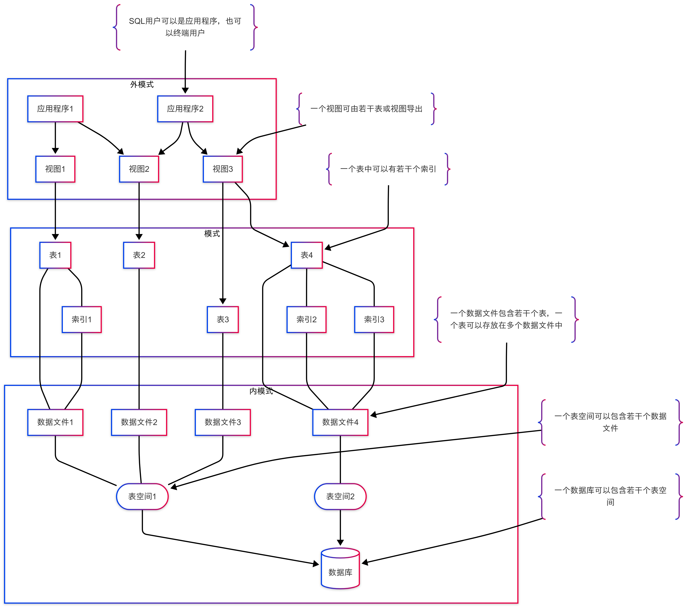

<!-- _class: cover_e -->
<!-- _paginate: "" -->
<!-- _footer:  -->
<!-- _header:  -->


# 第2章 关系数据库标准语言SQL

###### “SQL: Structured Query Language or Sometimes Quite Lame.”

井明
数据科学与计算机学院
jingming@sdu.edu.cn
2025年3月21日


---
<!-- _class: toc_b -->
<!-- _header: 目录<br>CONTENTS<br> -->
<!-- _footer: "" -->
<!-- _paginate: "" -->

- 2.1 SQL语言介绍
- 2.2 数据定义
- 2.3 数据查询 
- 2.4 数据的维护
- 2.5 索引和视图

## 2.1 SQL 语言介绍

### 关系数据库体系结构

---

<!-- _footer: '' -->



### 什么是SQL？


> SQL（Structured Query Language)是结构化查询语言，它是一种在关系数据库中定义和操纵数据的标准语言，是用户与数据库之间进行交流的接口。


### SQL的特点

SQL（Structured Query Language，结构化查询语言）是关系数据库管理系统（RDBMS）中用于定义、操作和管理数据的标准语言。SQL 具有以下主要特点：

1.	高级非过程化语言：SQL 侧重于描述“做什么”（What to do），而非“如何做”（How to do），用户只需指定查询目标，而不必关心具体实现细节。
2.	强大的数据操作能力：SQL 提供丰富的数据查询、插入、更新和删除功能，可高效管理关系数据库中的数据。
3.	数据定义与管理：SQL 允许用户创建、修改和删除数据库对象（如表、视图、索引、存储过程等），支持数据库的完整性约束（如主键、外键、唯一性约束）。
4.	标准化语言：SQL 是国际标准化组织（ISO）和美国国家标准协会（ANSI）认可的标准数据库语言，不同数据库系统（如 MySQL、PostgreSQL、SQL Server、Oracle 等）均支持 SQL，但在实现上可能存在方言差异。

---

5.	面向集合的操作：SQL 主要基于集合操作（如联合、交叉连接、筛选等），不同于面向记录的编程语言，可一次性处理多个数据行，提高查询效率。
6.	事务控制：SQL 支持事务（Transaction），提供 ACID（原子性、一致性、隔离性、持久性）特性，确保数据库操作的可靠性和安全性。
7.	多用户并发控制：SQL 支持多用户并发访问数据库，结合事务隔离级别和锁机制，防止数据不一致问题，如脏读、不可重复读和幻读。
8.	可扩展性和安全性：SQL 允许基于权限管理（GRANT、REVOKE）控制用户对数据库的访问权限，同时支持存储过程、触发器等扩展功能，增强数据库的可操作性和自动化能力。
9.	跨平台兼容性：SQL 适用于不同的操作系统和数据库管理系统，具备较好的可移植性，用户可以在多个环境中使用相同的 SQL 语句进行数据操作。

### SQL语言的组成

1．数据定义语言（DDL）
DDL用来定义(CREATE)、修改(ALTER)、删除(DROP)数据库中的各种对象。

2．数据操纵语言（DML）
DML的命令用来查询(SELECT)、插入(INSERT)、修改(UPDATE)、删除(DELETE)数据库中数据。

3、数据控制语言（DCL）
用于事务控制、并发控制、完整性和安全性控制等。 

#### SQL语言的主要动词

<!-- _class: cols-3 -->

<div class="ldiv">

- 数据定义
  - CREATE
  - DROP
  - ALTER

</div>
<div class="mdiv">

- 数据操纵
  - SELECT      
  - INSERT      
  - UPDATE       
  - DELETE
</div>
<div class="rdiv">

- 数据控制
  - GRANT        
  - REVOKE    
  - COMMIT      
  - ROLLBACK
</div>

### 测试

1、SQL语言是(       B        )的语言，易学习。
A）过程化       B）非过程化         C）格式化     D）导航式

2、SQL具有（            BCD                            ）功能。
A）关系规范化         B）数据定义         C）数据操纵      D）数据控制

3、下列关于基本表和存储文件之间关系的叙述中，错误的是（       ABC          ）
A）一个基本表只能存储于一个文件中，一个存储文件中也只能存放一个基本表
B）一个基本表只能存储于一个文件中，但一个存储文件中可存放多个基本表
C）一个基本表可以存储于一个或多个文件中，但一个存储文件中只能存放一个基本表
D）一个基本表可以存储于一个或多个文件中，一个存储文件中也可以存放一个或多个基本表

## 2.2 数据定义

### 数据库的定义和删除


1. 创建数据库（CREATE DATABASE）

`CREATE DATABASE` 语句用于创建一个新的数据库。

语法：

`CREATE DATABASE 数据库名;`

或

`CREATE DATABASE 数据库名 CHARACTER SET 字符集 COLLATE 校对规则;`

**示例**：创建一个名为 `student_db` 的数据库，并指定 `utf8mb4` 作为字符集：

```sql
CREATE DATABASE student_db CHARACTER SET utf8mb4 COLLATE utf8mb4_general_ci;
```

---

2. 删除数据库（DROP DATABASE）

`DROP DATABASE` 语句用于删除一个已存在的数据库，注意：删除后数据不可恢复。

语法：

`DROP DATABASE 数据库名;`

示例：删除 `student_db` 数据库：

```sql
DROP DATABASE student_db;
```

---

3. 选择数据库（USE DATABASE）

USE DATABASE 语句用于切换到指定的数据库，后续的 SQL 语句将在该数据库中执行。

语法：

USE 数据库名;

示例：

选择 `student_db` 数据库：

`USE student_db;`

### 数据类型

在 MySQL 中，数据类型主要分为：
- 数值类型
- 日期和时间类型
- 字符串（字符和文本）类型

---

1. 数值类型（Numeric Types）

整数类型

| 数据类型     | 字节 | 取值范围（有符号）                             | 取值范围（无符号）                             |
|--------------|------|-----------------------------------------------|-----------------------------------------------|
| TINYINT      | 1    | -128 ~ 127                                    | 0 ~ 255                                       |
| SMALLINT     | 2    | -32,768 ~ 32,767                              | 0 ~ 65,535                                    |
| MEDIUMINT    | 3    | -8,388,608 ~ 8,388,607                        | 0 ~ 16,777,215                                |
| INT / INTEGER| 4    | -2,147,483,648 ~ 2,147,483,647                | 0 ~ 4,294,967,295                             |
| BIGINT       | 8    | -9,223,372,036,854,775,808 ~ 9,223,372,036,854,775,807 | 0 ~ 18,446,744,073,709,551,615                |

示例：

```sql
CREATE TABLE students (
    id INT PRIMARY KEY AUTO_INCREMENT, -- 自增的主键ID
    age TINYINT NOT NULL CHECK (age >= 0 AND age <= 100) -- 限制年龄范围在 0-100
);
```

---

浮点类型

| 数据类型   | 字节 | 说明                                                                 |
|------------|------|----------------------------------------------------------------------|
| FLOAT(M,D) | 4    | 单精度浮点数（M 指定总位数，D 指定小数位数）                         |
| DOUBLE(M,D)| 8    | 双精度浮点数（比 FLOAT 精度更高）                                    |
| DECIMAL(M,D)| M+2 | 定点数，M 是总位数，D 是小数位，适用于精确计算（如财务计算）         |

示例：

```sql
CREATE TABLE products (
    id INT PRIMARY KEY AUTO_INCREMENT,
    price DECIMAL(10,2) NOT NULL -- 10 位总长度，保留 2 位小数
);
```
---

2. 日期和时间类型（Date and Time Types）


| 数据类型 | 字节 | 说明 |
|----------|------|------|
| DATE     | 3    | 仅存储日期，格式 YYYY-MM-DD |
| DATETIME | 8    | 存储日期和时间，格式 YYYY-MM-DD HH:MM:SS |
| TIMESTAMP| 4    | 自动存储时间戳（受时区影响） |
| TIME     | 3    | 仅存储时间，格式 HH:MM:SS |
| YEAR     | 1    | 存储年份，格式 YYYY |


示例：

```sql
CREATE TABLE orders (
    id INT PRIMARY KEY AUTO_INCREMENT,
    order_date DATE NOT NULL, -- 存储订单日期
    created_at TIMESTAMP DEFAULT CURRENT_TIMESTAMP -- 默认存储当前时间
);
```

---

3. 字符串类型（String Types）

定长字符串

| 数据类型 | 说明 |
|----------|------|
| CHAR(N)  | 定长字符串（最多 255 个字符），不足时会自动补空格 |
| VARCHAR(N) | 变长字符串（最多 65535 个字符，实际受行长度限制） |

示例：

```sql
CREATE TABLE users (
    username CHAR(20) NOT NULL, -- 用户名固定长度 20
    email VARCHAR(255) NOT NULL -- 邮箱变长字符串
);
```

---

文本类型


| 数据类型   | 最大存储容量 | 说明             |
|------------|--------------|------------------|
| TINYTEXT   | 255 字节     | 适用于较短文本   |
| TEXT       | 64 KB        | 适用于一般文本   |
| MEDIUMTEXT | 16 MB        | 适用于较大文本   |
| LONGTEXT   | 4 GB         | 适用于超大文本   |


示例：

```sql
CREATE TABLE articles (
    id INT PRIMARY KEY AUTO_INCREMENT,
    title VARCHAR(255) NOT NULL,
    content TEXT NOT NULL -- 存储文章内容
);
```
---

二进制类型

| 数据类型   | 说明                         |
|------------|------------------------------|
| BLOB       | 二进制大对象，适用于存储图片、文件等 |
| VARBINARY(N) | 变长二进制数据               |

示例：

```sql
CREATE TABLE files (
    id INT PRIMARY KEY AUTO_INCREMENT,
    file_data BLOB NOT NULL -- 存储二进制文件
);
```


---

总结

| 类型     | 关键字                                 | 适用场景                                      |
|----------|----------------------------------------|-----------------------------------------------|
| 整数     | TINYINT、SMALLINT、MEDIUMINT、INT、BIGINT | 适用于存储整型数据，如 ID、年龄、计数器       |
| 浮点     | FLOAT、DOUBLE、DECIMAL                 | 适用于存储小数，如价格、科学计算              |
| 日期时间 | DATE、DATETIME、TIMESTAMP、TIME、YEAR  | 适用于时间相关数据，如订单时间、注册时间      |
| 字符串   | CHAR、VARCHAR、TEXT                    | 适用于存储文本，如用户名、描述信息            |
| 二进制   | BLOB、VARBINARY                        | 适用于存储图片、文件、音频等                  |


### 表的定义、删除和修改

在 MySQL 中，CREATE TABLE、DESC TABLE、DROP TABLE 和 ALTER TABLE 是操作数据库表的重要 SQL 语句。以下是它们的语法及示例：

---

1. 创建表（CREATE TABLE）

用于创建一个新的数据表。

语法:

```sql
CREATE TABLE 表名 (
    列名 数据类型 [约束],
    列名 数据类型 [约束],
    ...
);
```

---

示例:

创建一个名为 students 的学生信息表：

```sql
CREATE TABLE students (
    id INT PRIMARY KEY AUTO_INCREMENT, -- 主键，自增
    name VARCHAR(50) NOT NULL,         -- 学生姓名，不能为空
    age TINYINT CHECK (age >= 0 AND age <= 100), -- 年龄，限制 0-100
    gender ENUM('Male', 'Female') NOT NULL, -- 性别，限定值
    admission_date DATE DEFAULT CURRENT_DATE -- 入学日期，默认为当前日期
);
```
---

2. 查看表结构（DESC TABLE 或 SHOW COLUMNS）

用于查看表的列信息、数据类型和约束。

语法

`DESC 表名;`

或：

`SHOW COLUMNS FROM 表名;`

示例

查看 students 表的结构：

`DESC students;`

或：

`SHOW COLUMNS FROM students;`

---

3. 删除表（DROP TABLE）

用于删除数据库中的表，删除后数据不可恢复。

语法

`DROP TABLE 表名;`

示例

删除 students 表：

`DROP TABLE students;`

---

4. 修改表（ALTER TABLE）

用于修改已有的表，如添加、删除或修改列。

常见操作

(1) 添加新列

`ALTER TABLE 表名 ADD COLUMN 列名 数据类型 [约束];`

示例：

`ALTER TABLE students ADD COLUMN email VARCHAR(100) UNIQUE;`

（在 students 表中添加 email 列，并设置唯一约束）

---

(2) 删除列

`ALTER TABLE 表名 DROP COLUMN 列名;`

示例：

`ALTER TABLE students DROP COLUMN email;`

（删除 students 表中的 email 列）

(3) 修改列的数据类型

`ALTER TABLE 表名 MODIFY COLUMN 列名 新数据类型;`

示例：

`ALTER TABLE students MODIFY COLUMN name VARCHAR(100);`

（将 name 列的数据类型修改为 VARCHAR(100)）

---

(4) 修改列名

`ALTER TABLE 表名 CHANGE COLUMN 旧列名 新列名 新数据类型;`

示例：

`ALTER TABLE students CHANGE COLUMN age student_age TINYINT;`

（将 age 列改名为 student_age）

(5) 修改表名

`ALTER TABLE 旧表名 RENAME TO 新表名;`

示例：

`ALTER TABLE students RENAME TO university_students;`

（将 students 表重命名为 university_students）

---

总结

| 语句                                 | 作用                                      |
|--------------------------------------|-------------------------------------------|
| CREATE TABLE                         | 创建新表                                  |
| DESC 表名 或 SHOW COLUMNS FROM 表名  | 查看表结构                                |
| DROP TABLE                           | 删除表（不可恢复）                        |
| ALTER TABLE                          | 修改表结构（添加、删除列，修改列名，修改数据类型，修改表名） |

### SQL 练习题：学生管理系统

请根据以下要求使用 SQL 语句完成数据库和表的创建、查询及修改操作。

1. 创建数据库

创建一个名为 school 的数据库，并使用 utf8mb4 作为字符集。

2. 创建表

在 school 数据库中创建一个 students 表，包含以下字段：

• id（学生 ID，INT 类型，主键，自增）
• name（姓名，VARCHAR(50)，不能为空）
• age（年龄，TINYINT，值范围 5-25）
• gender（性别，ENUM('Male', 'Female')，不能为空）
• email（邮箱，VARCHAR(100)，唯一）
• admission_date（入学日期，DATE，默认为当前日期）

---

3. 插入数据

向 students 表中插入以下数据：

| id | name | age | gender | email | admission_date |
|----|------|-----|--------|---------------------|----------------|
| 1  | 张三 | 18  | Male   | zhangsan\@example.com | 2023-09-01     |
| 2  | 李四 | 20  | Female | lisi\@example.com     | 2022-09-01     |
| 3  | 王五 | 22  | Male   | wangwu\@example.com   | 2021-09-01     |

---

4. 查询操作
	•	查询所有学生信息
	•	查询所有年龄大于 18 岁的学生
	•	查询 2022 年之后入学的学生

5. 修改表结构
	•	添加一个 phone 字段（VARCHAR(15)，允许为空）
	•	修改 name 字段长度为 VARCHAR(100)
	•	删除 email 字段

6. 删除表
	•	删除 students 表

## 2.3 数据查询

SELECT 语句是 SQL 中最常用的查询语句，用于从数据库表中检索数据。它支持各种查询方式，如筛选、排序、分组、聚合等。

---

1. 基本 SELECT 语法

`SELECT 列名1, 列名2, ... FROM 表名;`

或

`SELECT * FROM 表名;`

（* 代表选择所有列）

示例

查询 students 表中的所有数据：

`SELECT * FROM students;`

查询 students 表的 name 和 age 字段：

`SELECT name, age FROM students;`


---

2. 使用 WHERE 进行条件查询

WHERE 子句用于指定筛选条件。

语法

`SELECT 列名 FROM 表名 WHERE 条件;`

示例

查询年龄大于 18 的学生：

`SELECT name, age FROM students WHERE age > 18;`

查询名为 “张三” 的学生：

`SELECT * FROM students WHERE name = '张三';`

---

常见的条件运算符
| 运算符      | 说明           |
|-------------|----------------|
| =           | 等于           |
| != 或 <>    | 不等于         |
| >           | 大于           |
| <           | 小于           |
| >=          | 大于等于       |
| <=          | 小于等于       |
| BETWEEN     | 在某个范围内   |
| IN          | 在指定的多个值中 |
| LIKE        | 模糊匹配       |
| IS NULL     | 为空           |
| IS NOT NULL | 不为空         |

---

3. 使用 ORDER BY 进行排序

ORDER BY 子句用于对查询结果进行排序。

语法

`SELECT 列名 FROM 表名 ORDER BY 列名 [ASC|DESC];`

-	ASC（默认）表示升序
-	DESC 表示降序

示例

按年龄升序排列学生：

`SELECT * FROM students ORDER BY age ASC;`

按入学日期降序排列：

`SELECT * FROM students ORDER BY admission_date DESC;`


---

4. 使用 LIMIT 限制查询结果

LIMIT 语句用于限制返回的行数。

语法

`SELECT 列名 FROM 表名 LIMIT 数量;`

示例

查询前 3 个学生：

`SELECT * FROM students LIMIT 3;`

查询第 3 条到第 5 条数据（跳过前 2 条）：

`SELECT * FROM students LIMIT 2, 3;`

---

5. 使用 DISTINCT 进行去重

DISTINCT 关键字用于去除重复值。

语法

`SELECT DISTINCT 列名 FROM 表名;`

示例

查询 students 表中所有不同的性别：

`SELECT DISTINCT gender FROM students;`

---

6. 使用 GROUP BY 进行分组

GROUP BY 用于将相同值的数据归为一组，通常结合聚合函数使用。

语法

`SELECT 列名, 聚合函数(列名) FROM 表名 GROUP BY 列名;`

示例

按性别统计学生数量：

`SELECT gender, COUNT(*) FROM students GROUP BY gender;`

按年龄统计不同年龄段的学生数量：

`SELECT age, COUNT(*) FROM students GROUP BY age;`


---

7. 使用 HAVING 过滤分组

HAVING 作用类似于 WHERE，但用于 分组后的数据 进行筛选。

语法

`SELECT 列名, 聚合函数(列名) FROM 表名 GROUP BY 列名 HAVING 条件;`

示例

筛选出有 2 名及以上学生的性别：

`SELECT gender, COUNT(*) FROM students GROUP BY gender HAVING COUNT(*) >= 2;`


---

8. 使用 JOIN 进行表连接

JOIN 用于查询多个表之间的数据。

示例

假设有 students（学生表）和 classes（班级表）：

```sql
CREATE TABLE classes (
    id INT PRIMARY KEY AUTO_INCREMENT,
    class_name VARCHAR(50) NOT NULL
);

CREATE TABLE students (
    id INT PRIMARY KEY AUTO_INCREMENT,
    name VARCHAR(50) NOT NULL,
    class_id INT,
    FOREIGN KEY (class_id) REFERENCES classes(id)
);
```
---
查询每个学生的班级名称：

```sql
SELECT students.name, classes.class_name
FROM students
JOIN classes ON students.class_id = classes.id;
```


---

##### 总结：

SELECT 语法的完整定义:

```sql
SELECT [ALL | DISTINCT] 列名或表达式
FROM 表名
[JOIN 另一表 ON 连接条件]
[WHERE 条件]
[GROUP BY 列名]
[HAVING 组筛选条件]
[ORDER BY 列名 [ASC | DESC]]
[LIMIT 行数 [OFFSET 偏移量]];
```

---


| 关键字   | 作用 |
|----------|:---|
| SELECT   | 指定查询的列，可以是具体列名、*（所有列）或计算表达式                |
| ALL      | 默认选项，返回所有匹配的行（可以省略）                               |
| DISTINCT | 去重，返回唯一值                                                     |
| FROM     | 指定查询的表                                                         |
| JOIN     | 连接多个表，INNER JOIN、LEFT JOIN、RIGHT JOIN、FULL JOIN             |
| ON       | 指定 JOIN 的连接条件                                                 |
| WHERE    | 设定查询条件，筛选符合条件的行                                       |
| GROUP BY | 对查询结果分组，通常与聚合函数（COUNT、SUM、AVG 等）一起使用         |
| HAVING   | 用于筛选 GROUP BY 之后的分组结果（类似 WHERE）                      |
| ORDER BY | 按指定列排序，默认升序（ASC），降序使用 DESC                        |
| LIMIT    | 限制返回的行数                                                       |
| OFFSET   | 指定查询开始的偏移量（常用于分页）                                   |


---

##### 练习题：

请使用 SQL 语句完成以下查询任务：
	1.	查询 students 表中所有学生的 name 和 age。
	2.	查询 students 表中 age 大于 20 岁的学生信息。
	3.	查询 students 表中的不同性别 (DISTINCT)。
	4.	查询 students 表中年龄最大的学生 (ORDER BY)。
	5.	统计 students 表中不同年龄段的学生数量 (GROUP BY)。


### SQL 多表连接查询

在 SQL 中，多表连接（JOIN）用于从多个表中获取数据。常见的连接类型包括：

1.	相等连接（Inner Join）
2.	自然连接（Natural Join）
3.	自连接（Self Join）
4.	不等值连接（Theta Join）
5.	左外连接（Left Outer Join）
6.	右外连接（Right Outer Join）

---

##### 1. 相等连接（Inner Join）

定义
	•	连接两个表，并根据指定列的 相等关系 筛选数据。
	•	仅返回满足连接条件的行。

语法

```sql
SELECT 表1.列, 表2.列
FROM 表1
INNER JOIN 表2 ON 表1.列 = 表2.列;
```

---

<!-- _class: cols-2 -->

示例

<div class=ldiv>

表 1：students

| id | name | class_id |
|----|------|----------|
| 1  | 张三 | 101      |
| 2  | 李四 | 102      |
| 3  | 王五 | 101      |
</div>

<div class=rdiv>

表 2：classes

| id  | class_name   |
|-----|--------------|
| 101 | 计算机科学   |
| 102 | 数据科学     |
| 103 | 电子工程     |
</div>

---

查询学生及其班级名称

```sql
SELECT students.name, classes.class_name
FROM students
INNER JOIN classes ON students.class_id = classes.id;
```

结果

| name | class_name   |
|------|--------------|
| 张三 | 计算机科学   |
| 李四 | 数据科学     |
| 王五 | 计算机科学   |

---

##### 2. 自然连接（Natural Join）

定义
	•	NATURAL JOIN 自动匹配 两个表中 同名且相同类型 的列进行连接。
	•	省略 ON 语句。

语法

`SELECT * FROM 表1 NATURAL JOIN 表2;`

示例

`SELECT students.name, class_name
FROM students NATURAL JOIN classes;`

前提：students 和 classes 必须有相同名称的列（如 class_id），否则 NATURAL JOIN 可能无法正确执行。

---

##### 3. 自连接（Self Join）

定义
	•	将一个表当作两张表 进行连接，常用于 找出某种关系（如层级关系、朋友关系）。

语法

```sql
SELECT A.列名, B.列名
FROM 表名 A
JOIN 表名 B ON A.列名 = B.列名;
```
---

示例:   

表：employees（员工表）

| id | name | manager_id |
|----|------|------------|
| 1  | 张三 | NULL       |
| 2  | 李四 | 1          |
| 3  | 王五 | 1          |
| 4  | 赵六 | 2          |

---

查询每个员工及其上级的姓名

```sql
SELECT e1.name AS Employee, e2.name AS Manager
FROM employees e1
LEFT JOIN employees e2 ON e1.manager_id = e2.id;
```


结果

| Employee | Manager |
|----------|---------|
| 张三     | NULL    |
| 李四     | 张三    |
| 王五     | 张三    |
| 赵六     | 李四    |


---

##### 4. 不等值连接（Theta Join）

定义
	•	连接条件为 不等值，而不是相等（>、<、!=）。
	•	常用于 范围匹配。

---

示例

表：students

| id | name | score |
|----|------|-------|
| 1  | 张三 | 85    |
| 2  | 李四 | 92    |
| 3  | 王五 | 76    |

表：grades

| min_score | max_score | grade |
|-----------|-----------|-------|
| 90        | 100       | A     |
| 80        | 89        | B     |
| 70        | 79        | C     |

---

查询学生的成绩等级

```sql
SELECT students.name, students.score, grades.grade
FROM students
JOIN grades ON students.score BETWEEN grades.min_score AND grades.max_score;
```

结果

| name | score | grade |
|------|-------|-------|
| 张三 | 85    | B     |
| 李四 | 92    | A     |
| 王五 | 76    | C     |


---

##### 5. 左外连接（Left Outer Join）

定义
	•	返回左表的所有数据，即使右表中没有匹配项。
	•	右表匹配失败的行，右表数据填充 NULL。

语法

```sql
SELECT 表1.列, 表2.列
FROM 表1
LEFT JOIN 表2 ON 表1.列 = 表2.列;
```
---
示例

查询所有学生及其班级信息（即使班级表中没有匹配的 class_id）：

```sql
SELECT students.name, classes.class_name
FROM students
LEFT JOIN classes ON students.class_id = classes.id;
```

结果

| name | class_name   |
|------|--------------|
| 张三 | 计算机科学   |
| 李四 | 数据科学     |
| 王五 | 计算机科学   |
| 赵七 | NULL         |


---

##### 6. 右外连接（Right Outer Join）

定义
	•	返回右表的所有数据，即使左表中没有匹配项。
	•	左表匹配失败的行，左表数据填充 NULL。

语法

```sql
SELECT 表1.列, 表2.列
FROM 表1
RIGHT JOIN 表2 ON 表1.列 = 表2.列;
```
---
示例

查询所有班级及其对应的学生（即使 students 表中没有对应的 class_id）：

```sql
SELECT students.name, classes.class_name
FROM students
RIGHT JOIN classes ON students.class_id = classes.id;
```

结果

| name | class_name   |
|------|--------------|
| 张三 | 计算机科学   |
| 李四 | 数据科学     |
| 王五 | 计算机科学   |
| NULL | 电子工程     |


---

##### 总结

| 连接类型               | 作用                           |
|------------------------|--------------------------------|
| 相等连接（Inner Join） | 仅返回匹配的行                 |
| 自然连接（Natural Join）| 自动匹配同名列                 |
| 自连接（Self Join）    | 一个表与自身连接               |
| 不等值连接（Theta Join）| 连接条件使用 >、< 等不等值      |
| 左外连接（Left Join）  | 左表全部返回，右表匹配不到填 NULL |
| 右外连接（Right Join） | 右表全部返回，左表匹配不到填 NULL |

### SQL 子查询（Subquery）详解

1. 什么是子查询？

子查询（Subquery），又称 嵌套查询，是指在一个 SQL 语句中嵌套另一个 SQL 语句，并且子查询的结果可以作为主查询的筛选条件、计算值或数据来源。

子查询通常用于：
	•	作为 WHERE 条件筛选数据
	•	作为 SELECT 语句的值返回
	•	结合 IN、EXISTS、ANY、ALL 进行复杂查询
	•	用在 FROM 子句中（派生表）
	•	作为 UPDATE 或 DELETE 语句的条件

---

2. 子查询的基本语法

```sql
SELECT 列名
FROM 表名
WHERE 列名 运算符 (子查询);
```

其中：
	•	子查询必须包含在 () 内
	•	子查询必须返回单个值（标量子查询）或一列数据（列表子查询）
	•	子查询可以嵌套在 WHERE、SELECT、FROM、HAVING 等子句中

---

3. 子查询的类型

(1) WHERE 语句中的子查询

用于筛选满足特定条件的数据。

示例

查询工资高于本部门平均工资的员工

```sql
SELECT name, salary, department_id
FROM employees
WHERE salary > (
    SELECT AVG(salary) 
    FROM employees 
    WHERE department_id = employees.department_id
);
```

•	子查询：计算 employees 表中每个 department_id 的平均工资。
•	主查询：筛选出工资高于其部门平均工资的员工。

---

(2) IN 和 NOT IN 语句中的子查询

用于筛选属于某个集合（列表）的数据。

示例

查询所有在 “销售部” 工作的员工

```sql
SELECT name 
FROM employees 
WHERE department_id IN (
    SELECT id 
    FROM departments 
    WHERE name = '销售部'
);
```

•	子查询：查找 "销售部" 的 department_id。
•	主查询：找出 employees 表中 department_id 属于 "销售部" 的员工。

---

(3) EXISTS 和 NOT EXISTS 语句中的子查询

用于检查子查询是否返回结果，通常用于关联查询。

示例

查询有员工的部门

```sql
SELECT name 
FROM departments d
WHERE EXISTS (
    SELECT 1 
    FROM employees e
    WHERE e.department_id = d.id
);
```

•	子查询：检查 employees 表中是否存在对应 department_id 的数据。
•	主查询：只返回有员工的部门。

---

(4) SELECT 语句中的子查询

用于计算值并返回给主查询。

示例

查询每位员工的姓名、工资以及其部门的平均工资

```sql
SELECT name, salary, 
    (SELECT AVG(salary) FROM employees WHERE department_id = e.department_id) AS avg_salary
FROM employees e;
```

•	子查询：计算每个 department_id 的平均工资。
•	主查询：返回员工信息，并在 SELECT 语句中动态计算该员工所属部门的平均工资。

---

(5) HAVING 语句中的子查询

用于筛选聚合结果。

示例

查询员工数超过 5 人的部门

```sql
SELECT department_id, COUNT(*) AS num_employees
FROM employees
GROUP BY department_id
HAVING COUNT(*) > (
    SELECT AVG(num) FROM (
        SELECT COUNT(*) AS num FROM employees GROUP BY department_id
    ) AS dept_counts
);
```

•	子查询：计算所有部门的平均员工数。
•	主查询：筛选出员工数高于平均值的部门。

---

(6) FROM 语句中的子查询（派生表）

用于创建临时表（虚拟表），然后在主查询中使用。

示例

查询每个部门工资最高的员工

```sql
SELECT e.name, e.salary, e.department_id
FROM employees e
JOIN (
    SELECT department_id, MAX(salary) AS max_salary
    FROM employees
    GROUP BY department_id
) AS max_salaries
ON e.department_id = max_salaries.department_id 
AND e.salary = max_salaries.max_salary;
```

•	子查询：计算每个 department_id 的最高工资。
•	主查询：查找 employees 表中工资等于 max_salary 的员工。

---

4. 子查询 vs 连接（JOIN）
   
•	子查询 适用于返回单一值或小数据集，适合嵌套查询情况。
•	JOIN 连接 更适用于大数据集查询，在多数情况下比子查询性能更优。
| 对比项     | 子查询                         | JOIN 连接                     |
|------------|--------------------------------|-------------------------------|
| 适用场景   | 适用于小数据集或嵌套查询       | 适用于大数据集，查询性能更优 |
| 结构       | 嵌套结构，可读性较低           | 平铺结构，可读性更好         |
| 计算效率   | 可能多次执行子查询，效率较低   | 直接查询并连接数据，效率更高 |

建议：
	•	如果能用 JOIN，尽量避免子查询。
	•	子查询适合计算值，JOIN 适合多表数据查询。

---

##### 总结

| 子查询类型               | 适用情况               | 示例                             |
|--------------------------|------------------------|----------------------------------|
| WHERE 子查询             | 过滤数据               | 查找工资高于部门平均值的员工     |
| IN / NOT IN 子查询       | 判断是否在列表中       | 查询 “销售部” 员工               |
| EXISTS / NOT EXISTS 子查询 | 判断是否存在数据       | 查询有员工的部门                 |
| SELECT 子查询            | 计算并返回值           | 查询员工工资及部门平均工资       |
| HAVING 子查询            | 过滤聚合结果           | 过滤员工数高于平均值的部门       |
| FROM 子查询（派生表）    | 生成临时表             | 查询每个部门工资最高的员工       |

> 子查询是 SQL 语言中强大而灵活的工具，但在大数据量场景下，JOIN 可能会有更好的性能。

---

💡 学习建议
	1.	先掌握 WHERE 和 IN 子查询，它们最常见。
	2.	尝试 EXISTS / NOT EXISTS，用于优化查询效率。
	3.	掌握 FROM 子查询，用于创建临时表。

你可以试着写一些查询练习，比如：
	•	查询工资低于所有销售员工资的员工
	•	查询至少有 2 个员工的部门
	•	查询工资最高的员工信息

🚀 试试看，看看你能写出多少种不同的 SQL 语句！

## 2.4 数据的维护

在 SQL 语言中，数据操作主要包括 插入（INSERT）、删除（DELETE） 和 更新（UPDATE），它们分别用于向表中添加数据、删除数据和修改数据。

---

1. 插入数据（INSERT INTO）

(1) 语法

`INSERT INTO 表名 (列1, 列2, ...) VALUES (值1, 值2, ...);`

•	表名：指定要插入数据的表。
•	列名：指定要插入数据的列（可以省略，但必须提供所有列的值）。
•	VALUES：提供要插入的数据值。

---

(2) 示例

插入单行数据

`INSERT INTO employees (id, name, age, department_id, salary)
VALUES (1, '张三', 30, 2, 8000);`

插入多行数据

```sql
INSERT INTO employees (id, name, age, department_id, salary)
VALUES 
    (2, '李四', 28, 3, 7500),
    (3, '王五', 35, 2, 9500);
```

省略列名（插入所有列）

`INSERT INTO employees 
VALUES (4, '赵六', 26, 1, 7000);`

⚠️ 注意：省略列名时，必须保证 VALUES 中的值顺序与表结构完全一致。

---

从另一张表插入数据

```sql
INSERT INTO high_salary_employees (id, name, salary)
SELECT id, name, salary FROM employees WHERE salary > 9000;
```

•	从 employees 表中选出工资大于 9000 的员工，插入到 high_salary_employees 表中。

---

<!--fit-->

2. 删除数据（DELETE）

(1) 语法

`DELETE FROM 表名 WHERE 条件;`

•	表名：指定要删除数据的表。
•	条件：指定删除的条件，如果省略，则会删除表中的所有数据（⚠️危险操作）。

(2) 示例

删除指定行

`DELETE FROM employees WHERE id = 3;`

删除多个符合条件的行

`DELETE FROM employees WHERE salary < 7000;`

---

删除所有数据（⚠️慎用）

`DELETE FROM employees;`

>💡 注意
>•	DELETE 仅删除数据，不删除表结构。
•	如果省略 WHERE，则会删除所有数据，但表仍然存在。

---

3. 更新数据（UPDATE）

(1) 语法

```sql
UPDATE 表名 
SET 列1 = 新值1, 列2 = 新值2, ...
WHERE 条件;
```

•	表名：指定要更新的表。
•	SET：指定要更新的列和值。
•	WHERE：指定更新的条件，防止误更新所有数据。

---

(2) 示例

更新单条数据

```sql
UPDATE employees 
SET salary = 9000 
WHERE id = 2;
```

更新多条数据

```sql
UPDATE employees 
SET department_id = 2 
WHERE department_id = 1;
```

---

使用子查询更新

```sql
UPDATE employees 
SET salary = salary * 1.1 
WHERE department_id = (SELECT id FROM departments WHERE name = '销售部');
```

•	查询 销售部 的 department_id，然后给该部门的所有员工加薪 10%。

> 更新所有行（⚠️慎用）

`UPDATE employees 
SET salary = salary * 1.05;`

💡 注意
	•	WHERE 条件很重要，避免无意中修改所有数据！
	•	可结合 SELECT 语句查看更新后的数据：

`SELECT * FROM employees WHERE id = 2;`


---

<!--_class: cols-2-->

4. 🌟 练习题
   
<div class=ldiv>

请根据以下 students 表，完成相关的 INSERT、DELETE 和 UPDATE 操作。

| id | name | age | grade |
|----|------|-----|-------|
| 1  | 张三 | 18  | 90    |
| 2  | 李四 | 19  | 85    |
| 3  | 王五 | 17  | 92    |
| 4  | 赵六 | 20  | 78    |
</div>
<div class=rdiv>

问题
	1.	新增一名学生 钱七，年龄 18，成绩 88。
	2.	删除所有成绩低于 80 的学生。
	3.	将所有学生的成绩提高 5 分。
	4.	查询更新后的 students 表数据。

💡 思考
	•	如何确保删除前不会误删重要数据？
	•	更新数据前如何先查询确认？

尝试写 SQL 语句来解决这些问题吧！ 🚀
</div>


## 2.5  数据库索引概念

索引是数据库中一种优化查询性能的数据结构。它类似于书籍的目录，可以帮助数据库系统快速定位需要的数据，而不必扫描整个表。

### 索引的原理

索引的基本原理是通过建立键值对映射，将索引列的值与对应记录的存储位置关联起来。常见的索引数据结构包括：

1. **B-树/B+树索引**：最常用的索引类型，适合范围查询和等值查询
2. **哈希索引**：适合等值查询，但不适合范围查询
3. **全文索引**：用于文本搜索
4. **空间索引**：用于地理空间数据

当我们执行一个查询时，数据库系统会首先检查是否有可用的索引。如果有，则使用索引快速定位数据；如果没有，则需要进行全表扫描。

### 索引的优缺点

**优点：**
- 加速数据检索操作
- 加速表连接操作
- 加速排序和分组操作

**缺点：**
- 占用额外的存储空间
- 降低了写操作（INSERT、UPDATE、DELETE）的性能
- 需要维护成本

## SQL中的索引操作

##### 创建索引

创建索引的基本语法：

```sql
CREATE INDEX index_name ON table_name (column1, column2, ...);
```

###### 创建唯一索引

```sql
CREATE UNIQUE INDEX index_name ON table_name (column1, column2, ...);
```

###### 创建复合索引

```sql
CREATE INDEX index_name ON table_name (column1, column2, column3);
```

### 删除索引

删除索引的基本语法：

```sql
DROP INDEX index_name ON table_name;
```
---
在不同的数据库管理系统中可能有些语法差异：

MySQL:
```sql
DROP INDEX index_name ON table_name;
```
SQL Server:
```sql
DROP INDEX table_name.index_name;
```
Oracle:
```sql
DROP INDEX index_name;
```

## 索引使用示例

让我们通过一个学生表的例子来演示索引的使用：

```sql
-- 创建学生表
CREATE TABLE students (
    student_id INT PRIMARY KEY,
    name VARCHAR(50),
    age INT,
    class VARCHAR(20),
    enrollment_date DATE
);

-- 插入一些示例数据
INSERT INTO students VALUES 
(1, '张三', 20, '计算机科学', '2023-09-01'),
(2, '李四', 21, '软件工程', '2022-09-01'),
(3, '王五', 19, '计算机科学', '2023-09-01'),
(4, '赵六', 22, '数据科学', '2021-09-01'),
(5, '钱七', 20, '软件工程', '2023-09-01');
```

### 创建索引示例

```sql
-- 在班级列上创建索引，优化按班级查询的性能
CREATE INDEX idx_class ON students (class);

-- 在年龄列上创建索引，优化按年龄查询的性能
CREATE INDEX idx_age ON students (age);

-- 创建复合索引，优化同时按班级和入学日期查询的性能
CREATE INDEX idx_class_date ON students (class, enrollment_date);
```

### 使用索引的查询示例

```sql
-- 这个查询会使用idx_class索引
SELECT * FROM students WHERE class = '计算机科学';

-- 这个查询会使用idx_age索引
SELECT * FROM students WHERE age > 20;

-- 这个查询会使用idx_class_date复合索引
SELECT * FROM students WHERE class = '软件工程' AND enrollment_date = '2023-09-01';
```

### 查看索引

大多数数据库系统提供了查看索引的方法：

MySQL:
```sql
SHOW INDEX FROM students;
```

SQL Server:
```sql
EXEC sp_helpindex 'students';
```

Oracle:
```sql
SELECT * FROM USER_INDEXES WHERE TABLE_NAME = 'STUDENTS';
```

### 删除索引示例

```sql
-- 删除班级索引
DROP INDEX idx_class ON students;

-- 删除年龄索引
DROP INDEX idx_age ON students;
```

## 索引选择和优化建议

1. **选择高选择性的列**：选择基数高的列（即有大量不同值的列）建立索引效果更好
2. **考虑查询频率**：经常在WHERE子句、JOIN条件或ORDER BY子句中出现的列是建立索引的好候选
3. **避免过多索引**：每个表的索引不宜过多，因为会增加存储和维护成本
4. **定期分析和重建索引**：随着数据变化，索引可能变得碎片化，需要定期优化

> 索引是数据库性能优化的重要手段，掌握索引的创建和使用对于设计高效的数据库系统至关重要。

## SQL视图（View）

## 视图的概念和原理

视图是一个虚拟表，它基于SQL查询的结果集构建，但不存储实际数据。视图本质上是一个存储在数据库中的查询，每次访问视图时，数据库系统都会执行该查询并返回结果。视图的主要原理包括：

1. **虚拟性**：视图不存储实际数据，只存储查询定义
2. **动态性**：视图数据随着基表数据的变化而变化
3. **简化性**：可以隐藏复杂的查询逻辑，提供简单接口

## 视图的优点

1. **简化复杂查询**：将复杂查询封装为简单视图
2. **提供数据安全性**：只允许用户访问特定的数据列
3. **数据独立性**：应用程序与底层表结构解耦
4. **定制用户数据视图**：不同用户可以看到不同格式的数据

## 创建视图

创建视图的基本语法：

```sql
CREATE VIEW view_name AS
SELECT column1, column2, ...
FROM table_name
WHERE condition;
```

### 示例：创建简单视图

假设我们有一个学生表和一个课程成绩表：

```sql
-- 学生表
CREATE TABLE students (
    student_id INT PRIMARY KEY,
    name VARCHAR(50),
    age INT,
    major VARCHAR(50)
);
-- 课程成绩表
CREATE TABLE course_grades (
    grade_id INT PRIMARY KEY,
    student_id INT,
    course_name VARCHAR(50),
    score INT,
    FOREIGN KEY (student_id) REFERENCES students(student_id)
);
```
---

```sql
-- 插入示例数据
INSERT INTO students VALUES 
(1, '张三', 20, '计算机科学'),
(2, '李四', 21, '软件工程'),
(3, '王五', 19, '数据科学');

INSERT INTO course_grades VALUES
(1, 1, '数据库原理', 89),
(2, 1, '操作系统', 92),
(3, 2, '数据库原理', 78),
(4, 2, '计算机网络', 85),
(5, 3, '数据库原理', 94);
```

创建一个显示学生成绩详情的视图：

```sql
CREATE VIEW student_grade_details AS
SELECT s.student_id, s.name, s.major, c.course_name, c.score
FROM students s
JOIN course_grades c ON s.student_id = c.student_id;
```
---
使用视图：

```sql
-- 查询视图中的所有数据
SELECT * FROM student_grade_details;

-- 使用条件查询视图
SELECT * FROM student_grade_details WHERE course_name = '数据库原理';
```

### 创建带计算列的视图

```sql
CREATE VIEW course_statistics AS
SELECT course_name, 
       COUNT(*) AS student_count, 
       AVG(score) AS average_score,
       MAX(score) AS highest_score,
       MIN(score) AS lowest_score
FROM course_grades
GROUP BY course_name;
```

### 创建WITH CHECK OPTION的视图

WITH CHECK OPTION可以防止通过视图进行的修改违反视图的WHERE条件：

```sql
CREATE VIEW cs_students AS
SELECT * FROM students
WHERE major = '计算机科学'
WITH CHECK OPTION;
```

如果尝试通过此视图修改学生专业为非"计算机科学"，数据库将拒绝操作。

### 修改视图

##### 替换现有视图

```sql
CREATE OR REPLACE VIEW student_grade_details AS
SELECT s.student_id, s.name, s.major, c.course_name, c.score,
       CASE 
           WHEN c.score >= 90 THEN 'A'
           WHEN c.score >= 80 THEN 'B'
           WHEN c.score >= 70 THEN 'C'
           WHEN c.score >= 60 THEN 'D'
           ELSE 'F'
       END AS grade_letter
FROM students s
JOIN course_grades c ON s.student_id = c.student_id;
```

### 使用ALTER VIEW语句（部分数据库支持）

```sql
-- SQL Server语法
ALTER VIEW student_grade_details AS
SELECT s.student_id, s.name, s.major, c.course_name, c.score
FROM students s
JOIN course_grades c ON s.student_id = c.student_id
WHERE c.score > 60;
```

## 删除视图

```sql
DROP VIEW [IF EXISTS] view_name;
```

例如：

```sql
DROP VIEW student_grade_details;
```

## 可更新视图

某些简单视图可以通过视图直接更新基表数据：

```sql
-- 创建可更新视图
CREATE VIEW computer_science_students AS
SELECT student_id, name, age
FROM students
WHERE major = '计算机科学';

-- 通过视图插入数据
INSERT INTO computer_science_students (student_id, name, age)
VALUES (4, '赵六', 22);
-- 注意：这会同时在students表中插入记录，major将是'计算机科学'
```
---

```sql
-- 通过视图更新数据
UPDATE computer_science_students
SET age = 23
WHERE student_id = 1;

-- 通过视图删除数据
DELETE FROM computer_science_students
WHERE student_id = 3;
```

视图可更新的一般条件：
1. 视图只基于一个表
2. 不包含GROUP BY、HAVING、聚合函数
3. 不包含DISTINCT
4. 不包含子查询

## 视图和索引

某些数据库支持索引视图（也称实体化视图），可以提高视图查询性能：

```sql
-- SQL Server中创建索引视图
CREATE VIEW dbo.course_average_scores
WITH SCHEMABINDING AS
SELECT course_name, AVG(score) AS average_score
FROM dbo.course_grades
GROUP BY course_name;

CREATE UNIQUE CLUSTERED INDEX IX_course_average_scores
ON dbo.course_average_scores(course_name);
```

## 视图使用场景示例

##### 数据安全控制

```sql
-- 为教务人员创建只显示成绩统计的视图
CREATE VIEW dean_course_statistics AS
SELECT course_name, COUNT(*) AS student_count, AVG(score) AS average_score
FROM course_grades
GROUP BY course_name;
```

### 简化复杂查询

```sql
-- 创建视图显示每个学生的平均分和排名
CREATE VIEW student_rankings AS
SELECT s.student_id, s.name, 
       AVG(c.score) AS average_score,
       RANK() OVER (ORDER BY AVG(c.score) DESC) AS ranking
FROM students s
JOIN course_grades c ON s.student_id = c.student_id
GROUP BY s.student_id, s.name;
```

> 视图是SQL中非常强大的功能，可以大大简化数据库设计和应用程序开发。通过合理使用视图，我们可以提高数据库的安全性、灵活性和易用性。