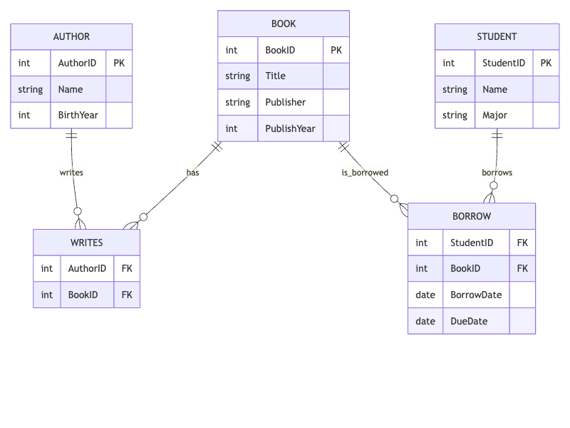

<!-- _class: cover_e -->
<!-- _paginate: "" -->
<!-- _footer:  -->
<!-- _header:  -->

#  🎓 作业三：数据库ER图与关系模式设计

井明
数据科学与计算机学院
jingming@sdu.edu.cn
2025年春

## ✅ 题目：图书管理系统ER图与关系模式设计

### 🧠 考查知识点
1. 	实体、属性与主键的识别
1. 	实体间联系的抽象与建模
1. 	一对多、多对多联系的表达
1. 	ER图的绘制
1. 	ER图向关系模式的转换

### 🎯 学习目标
1. 	理解并掌握ER图的构建方法
2. 	能够从需求分析中提取实体、属性及关系
3. 	能将ER图正确转换为关系数据库的关系模式
4. 	理解主外键的定义及作用

### 📋 内容描述：图书管理系统

某高校图书馆希望构建一个图书管理系统，其基本需求如下：

1.	每本书有唯一编号（BookID）、书名、出版社、出版年份。
2.	每位作者有唯一编号（AuthorID）、姓名、出生年份。
3.	一本书可以由多个作者合著，一个作者也可能写多本书。
4.	每位学生有学号（StudentID）、姓名、专业。
5.	学生可以借阅多本图书，一本图书也可能被多名学生借阅（但同一时刻只能被一人借出）。
6.	借书记录需要包含借阅日期和应还日期。

### 📌 问题要求
1.	根据上述描述，画出该系统的ER图。
2.	将ER图转换为关系模式（用关系代数表示法），指出主键和外键。

### 🖼️ 参考答案：ER图

----

📘 参考答案：关系模式
	1.	BOOK(<u>BookID</u>, Title, Publisher, PublishYear)
主键：BookID
	2.	AUTHOR(<u>AuthorID</u>, Name, BirthYear)
主键：AuthorID
	3.	STUDENT(<u>StudentID</u>, Name, Major)
主键：StudentID
	4.	WRITES(<u>AuthorID, BookID</u>)
主键：(AuthorID, BookID)
外键：AuthorID → AUTHOR, BookID → BOOK
	5.	BORROW(<u>StudentID, BookID, BorrowDate</u>, DueDate)
主键：(StudentID, BookID, BorrowDate)
外键：StudentID → STUDENT, BookID → BOOK
