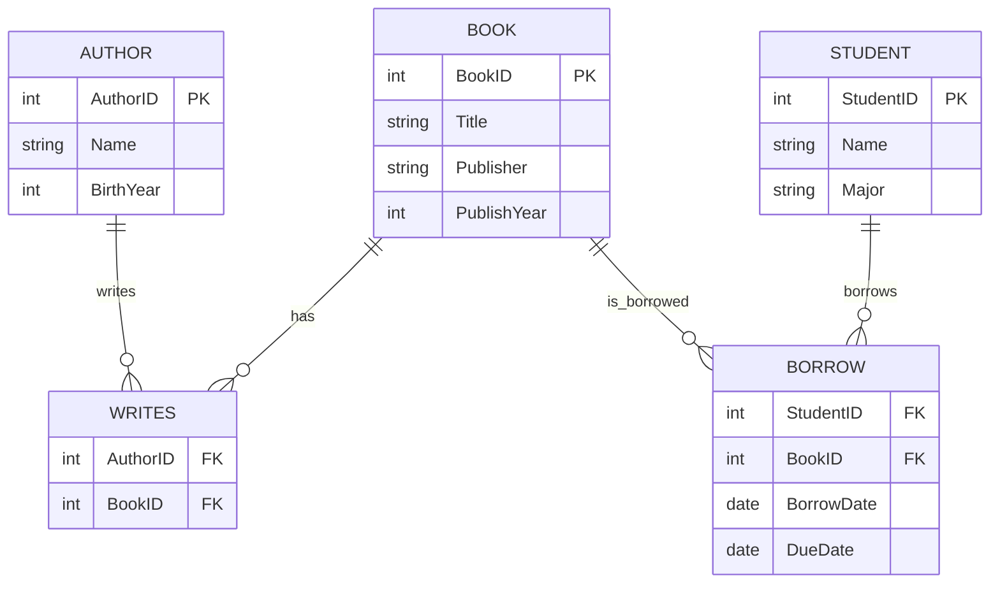

```mermaid
erDiagram
    BOOK {
        int BookID PK
        string Title
        string Publisher
        int PublishYear
    }
    AUTHOR {
        int AuthorID PK
        string Name
        int BirthYear
    }
    STUDENT {
        int StudentID PK
        string Name
        string Major
    }
    BORROW {
        int StudentID FK
        int BookID FK
        date BorrowDate
        date DueDate
    }
    WRITES {
        int AuthorID FK
        int BookID FK
    }

    BOOK ||--o{ WRITES : has
    AUTHOR ||--o{ WRITES : writes

    STUDENT ||--o{ BORROW : borrows
    BOOK ||--o{ BORROW : is_borrowed
```