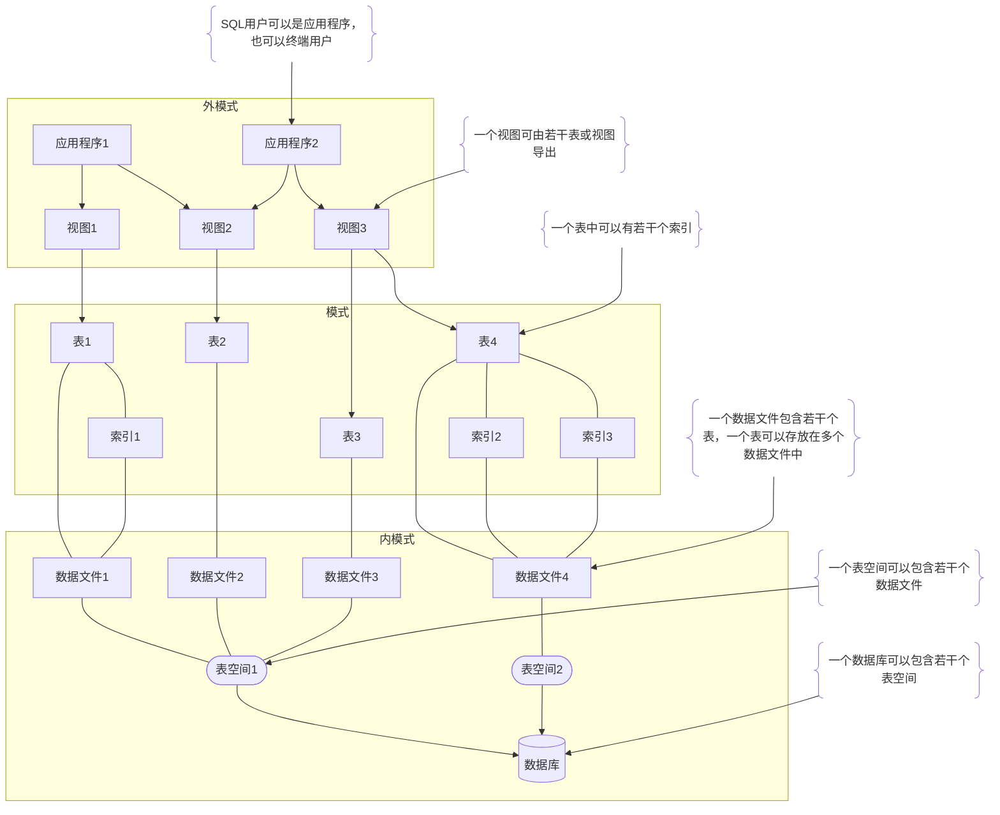

```mermaid
flowchart TB
 subgraph s1["外模式"]
        n1["应用程序1"]
        n2["应用程序2"]
        v1["视图1"]
        v2["视图2"]
        v3["视图3"]
  end
 subgraph s2["模式"]
        b1["表1"]
        b2["表2"]
        b3["表3"]
        b4["表4"]
        i1["索引1"]
        i2["索引2"]
        i3["索引3"]
  end
 subgraph s3["内模式"]
        f1["数据文件1"]
        f2["数据文件2"]
        f3["数据文件3"]
        f4["数据文件4"]
        ts1(["表空间1"])
        ts2(["表空间2"])
        db["数据库"]
  end
    n1 --> v1 & v2
    n2 --> v2 & v3
    v1 --> b1
    v2 --> b2
    v3 --> b3 & b4
    b1 --- i1 & f1
    b4 --- i2 & f4 & i3
    b2 --- f2
    b3 --- f3
    i1 --- f1
    i2 --- f4
    i3 --- f4
    f1 --- ts1
    f2 --- ts1
    f3 --- ts1
    f4 --- ts2
    ts1 --> db
    ts2 --> db
    c1["SQL用户可以是应用程序，也可以终端用户"] --> n2
    n3["一个视图可由若干表或视图导出"] --> v3
    n4["一个表中可以有若干个索引"] --> b4
    n5["一个数据文件包含若干个表，一个表可以存放在多个数据文件中"] --> f4
    n6["一个表空间可以包含若干个数据文件"] --> ts1
    n7["一个数据库可以包含若干个表空间"] --> db

    db@{ shape: db}
    c1@{ shape: braces}
    n3@{ shape: braces}
    n4@{ shape: braces}
    n5@{ shape: braces}
    n6@{ shape: braces}
    n7@{ shape: braces}

```